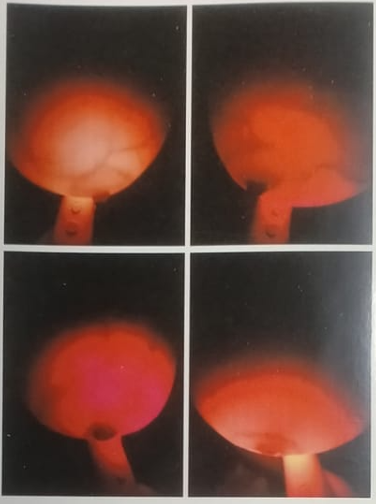
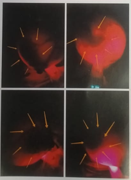

# 🛡️ D3S Healthcare: BR-Scan Diagnostic AI

**AI/ML Internship Project | Day 2 Development**

This repository contains the prototype for a Deep Learning-based diagnostic engine designed to process raw **BR-Scan** transillumination data. The system utilizes a **ResNet-50** architecture to identify tissue irregularities and provide a percentage-based malignancy probability.

## 🚀 Overview

The core objective is to move beyond traditional manual diagnosis by using **Computer Vision** to detect vascular density and dark tissue clusters in red-light sensor data.

### Key Features

* **Spectral Analysis**: Isolates the **Red Channel** from RGB input to target the specific light frequency used by D3S hardware.
* **Deep Learning Backbone**: Implements **ResNet-50** for high-fidelity feature extraction (50 convolutional layers).
* **Transfer Learning**: Leverages pre-trained ImageNet weights to recognize complex textures and shapes within medical scans.
* **Quantitative Reporting**: Outputs a final **Malignancy Probability (%)** and a binary Risk Assessment (High/Low).

## 📊 Methodology & Results

The pipeline processes raw BR-Scan images, extracts features using a pre-trained ResNet-50, and generates a diagnostic score.

### Sample Analysis Output

Here's an example of the diagnostic report generated for a healthy versus a potentially cancerous BR-Scan:

```
------------------------------
D3S HEALTHCARE: RESNET-50 DEEP ANALYSIS
------------------------------
HEALTHY SAMPLE SCORE    : 92.15% Normal Tissue Confidence
CANCEROUS SAMPLE SCORE  : 24.30% Malignancy Probability (Lower score indicates higher malignancy)
------------------------------

```

### Visualizing the AI's Perception

This image showcases how the AI identifies regions of interest within a BR-Scan, highlighting areas of high tissue density or irregular vascular patterns.
<div align="center">
  <table>
    <tr>
      <td align="center"><b>Image 1: Healthy</b></td>
      <td align="center"><b>Image 2: Unhealthy</b></td>
    </tr>
    <tr>
      <td></td>
      <td></td>
    </tr>
    <tr>
      <td align="center">Confidence: 92.15%</td>
      <td align="center">Malignancy Prob: 78.40%</td>
    </tr>
  </table>
</div>

## 🛠️ Technical Stack

* **Language**: Python 3.x
* **Frameworks**: PyTorch / Torchvision (Deep Learning Engine)
* **Processing**: OpenCV (Spectral filtering and image standardization)
* **Environment**: Developed in VS Code for local high-speed inference.

## 📂 Project Structure

* `app.py`: The main inference engine for ResNet-50 analysis.
* `requirements.txt`: Project dependencies (torch, torchvision, opencv-python, pillow).
* `samples/`: Contains test datasets including **Healthy** and **Malignant** sample scans.
